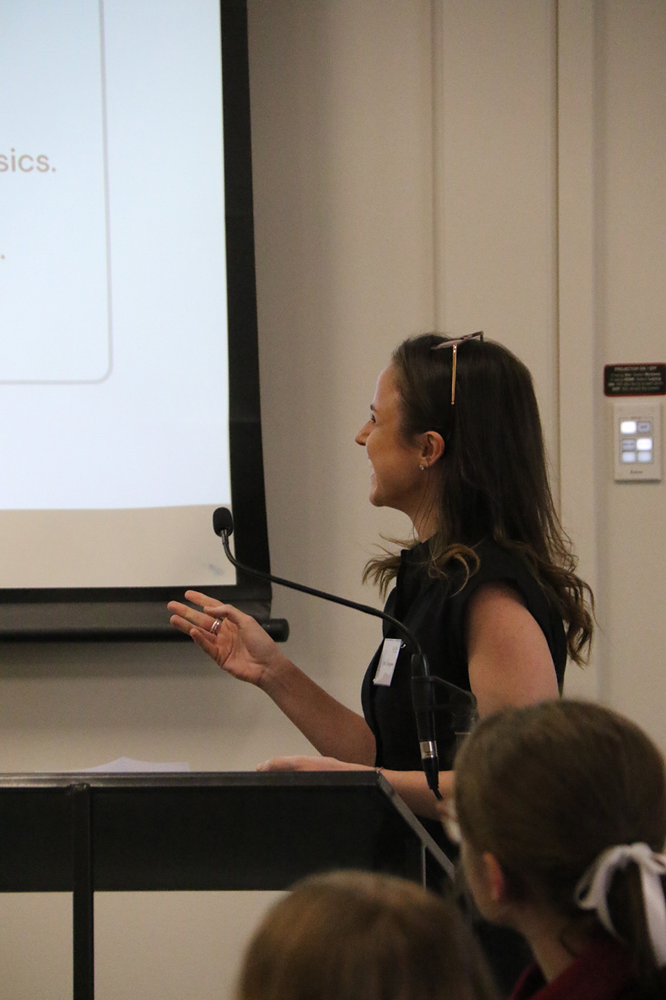

# Hi, I'm Giulia

I am a Research Software Engineer at the Centre for Astrophysics and Supercomputing at Swinburne University of Technology.

I help manage the [OzSTAR and Ngarrgu Tindebeek supercomputers](https://supercomputing.swin.edu.au/). The other half of my time is spent on projects with [Astronomy Data and Computing Services](https://adacs.org.au/), where I develop and optimise software and computational tools for researchers across astronomy and other sciences.

My PhD was in stellar astrophysics, and I still like doing [star things](https://arxiv.org/pdf/2511.23104). I work on stellar nucleosynthesis, understanding how stars produce and redistribute the elements that make up the Universe.

